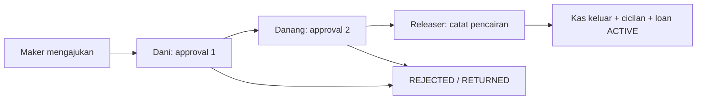

# Setup Hirarki dan approval pinjaman

Implementasi ini menambahkan workflow pinjaman per keluarga. Ini adalah tahap pertama Business V2, bukan implementasi tabungan, double-entry, SMTP, atau seluruh spesifikasi lampiran.

## Penggunaan

1. Masuk sebagai **Super Admin → Setup Hirarki**. Pilih keluarga, misalnya Keluarga Dani. Admin keluarga juga dapat mengatur keluarga aktifnya sendiri.
2. Pilih anggota yang boleh menjadi **Maker**.
3. Atur approver berurutan: **1. Dani → 2. Danang**. Gunakan panah untuk mengubah urutan, tambah/hapus tahap bila diperlukan. Maksimal 10 approver.
4. Pilih **Releaser** yang berbeda dari seluruh approver. Untuk contoh dua approver, siapkan minimal empat orang: Maker, Dani, Danang, dan Releaser. Seluruh petugas harus anggota aktif keluarga terkait dan bukan akun Super Admin.
5. Tulis alasan konfigurasi lalu simpan. Daftar versi sebelumnya tetap tersedia.
6. Maker membuka **Pinjaman → Ajukan pinjaman**. Tombol pengajuan tersedia jika penugasan Maker sudah sesuai. Nominal, tenor, tujuan, dan hak akses tetap divalidasi backend.
7. Dani membuka **Persetujuan → Menunggu Saya**, membaca pengajuan, lalu menyetujui. Danang baru mendapat tugas setelah Dani menyetujui.
8. Sesudah Danang menyetujui, pinjaman menjadi **APPROVED / menunggu pencairan**. Cicilan dan kas keluar belum dibuat.
9. Releaser memastikan transfer sudah dilakukan sesuai prosedur keluarga, lalu memilih **Catat pencairan**. Sistem mencatat satu kas keluar, membentuk cicilan, dan mengaktifkan pinjaman. Tombol ini tidak mentransfer dana melalui bank.

Anggota multikeluarga dapat memilih **Keluarga aktif**. Pergantian konteks memverifikasi membership di server, memperbarui token, dan memuat ulang halaman agar formulir/data keluarga sebelumnya tidak terbawa. Notifikasi keluarga lain meminta pengguna memilih keluarga yang sesuai dahulu.

## Aturan keputusan

- Role organisasi ADMIN/MEMBER tidak otomatis memberikan hak approve/release. Hak ditentukan oleh petugas pada tahap aktif.
- Super Admin mengatur platform/hirarki, tetapi tidak dapat mengajukan, menyetujui, mencairkan pinjaman, mencatat kas, atau memproses pembayaran.
- Maker maupun peminjam tidak boleh menyetujui atau mencairkan pengajuan yang sama. Releaser berbeda dari semua approver. Pilihan Maker yang tumpang tindih dengan petugas keputusan ditandai di UI dan tidak bisa mengajukan dengan kebijakan tersebut.
- Hanya tahap aktif yang dapat bertindak. Approver dapat menyetujui, menolak, atau mengembalikan; penolakan/pengembalian memerlukan alasan.
- Pengembalian menutup pengajuan tersebut (`RETURNED`, Loan `CANCELLED`). Maker membuat pengajuan baru dengan data yang diperbaiki; riwayat lama tetap ada. Belum ada edit/resubmit pada request yang sama.
- Riwayat `ApprovalAction` tidak dapat diubah/dihapus melalui aplikasi; trigger PostgreSQL juga menolak UPDATE/DELETE.
- Request diserialisasi memakai row lock. Klik approve/release berulang oleh petugas yang sama menjadi no-op setelah berhasil. Pencairan, cicilan, ledger, action, audit, dan notifikasi berada dalam satu transaksi.
- Perubahan hirarki membuat versi baru. Request lama tetap memakai snapshot petugas/urutan versi sebelumnya. Versi editor mencegah penimpaan perubahan pengguna lain.
- Petugas yang dinonaktifkan tidak dapat bertindak. Belum ada penggantian petugas pada request berjalan; pengelola harus meninjau kasus tersebut, bukan sekadar mengubah kebijakan untuk request baru.

## Status

Tab **Menunggu Saya** memuat hanya tahap aktif milik akun tersebut. **Sudah Diproses** memuat keputusan yang pernah diambil akun. **Semua** menampilkan seluruh request keluarga untuk Admin, atau request yang dibuat/ditugaskan kepada anggota biasa. Daftar menggunakan pagination 20 item. Notifikasi tugas membuka detail request terkait.

## Database

| Tabel | Fungsi |
| --- | --- |
| `ApprovalPolicy` | Kebijakan per keluarga/jenis transaksi, versi, status aktif, pembuat, alasan |
| `ApprovalAssignment` | Maker, approver berurutan, dan releaser per versi kebijakan |
| `ApprovalRequest` | Snapshot pengajuan: keluarga, versi, maker, referensi pinjaman, nominal, status, tahap aktif |
| `ApprovalStep` | Salinan petugas dan urutan setiap tahap saat pengajuan dibuat |
| `ApprovalAction` | Jejak append-only: actor, keputusan, tahap, alasan, waktu |
| `Loan.approvalRequestId` | Relasi unik pinjaman ke request; nullable untuk menjaga data lama |
| `AuditLog` | Perubahan kebijakan dan tindakan workflow |

Index parsial memastikan hanya satu policy aktif per keluarga/jenis. Jenis selain `LOAN` baru disiapkan sebagai enum; belum ada alur tabungan/deposit aktif.

## API

Semua endpoint menggunakan prefix `/api/v1` dan Bearer token.

| Endpoint | Kegunaan |
| --- | --- |
| `GET /approval-policies/families` | Keluarga yang boleh dikonfigurasi |
| `GET /approval-policies/families/:id` | Policy aktif, kandidat anggota aktif, riwayat versi |
| `PUT /approval-policies/families/:id` | Simpan versi baru; body `expectedVersion`, `makerIds`, `approverIds`, `releaserId`, `reason` |
| `GET /approvals/permissions` | Status konfigurasi dan hak pengajuan akun pada keluarga aktif |
| `GET /approvals?tab=mine\|processed\|all&page=1` | Inbox request |
| `GET /approvals/:id` | Detail request dalam scope keluarga dan partisipasi pengguna |
| `POST /approvals/:id/approve` | Setujui tahap aktif |
| `POST /approvals/:id/reject` | Tolak; body `notes` wajib |
| `POST /approvals/:id/return` | Kembalikan; body `notes` wajib |
| `POST /approvals/:id/release` | Catat pencairan setelah seluruh approver selesai |
| `POST /auth/active-family` | Ganti konteks; body `familyId` |

URL approve/reject/disburse pinjaman versi lama tetap mengarah ke engine yang sama. Tidak ada jalur bypass berdasarkan role admin.

## Notifikasi dan batas integrasi

Tugas per tahap menggunakan notifikasi di aplikasi. Event pinjaman untuk peminjam tetap menggunakan outbox WhatsApp yang sudah ada: pengajuan diterima, approval terakhir, ditolak, dan dicairkan. Pemberitahuan pengajuan tidak lagi dikirim massal ke semua admin/bendahara; tugas diarahkan ke approver yang tepat. WhatsApp tetap **simulasi**, bukan pengiriman nyata. Email SMTP/outbox belum diimplementasikan pada tahap ini.

## Verifikasi

- Pemeriksaan akhir 17 September 2026: **79 tes backend lulus**, build frontend/backend lulus, validasi Prisma lulus, dan lint frontend lulus.
- Unit/service dan HTTP tests: konfigurasi, versi usang, lintas keluarga, pembatasan Super Admin, self-approval, actor tidak aktif, urutan, penolakan/pengembalian, saldo kurang, idempotensi, konteks keluarga, dan kompatibilitas endpoint lama.
- PostgreSQL asli dalam schema sementara: seluruh migration dari awal, Dani → Danang → Releaser, perubahan policy tanpa mengubah snapshot, request paralel untuk approve/release menghasilkan satu posting, trigger riwayat immutable dan satu policy aktif. Schema fixture dihapus setelah uji.
- `scripts/verify-approval-flow.ts` hanya mau dijalankan pada schema bernama `approval_test_<hex>` yang telah diprovisikan dengan seluruh migration. Script tidak boleh diarahkan ke schema aplikasi.
- UI Chrome dengan API fixture: menu Super Admin, konfigurasi Dani/Danang, urutan body simpan, riwayat versi, desktop dan ponsel 390 px, tanpa horizontal overflow atau error JavaScript.

- Pemeriksaan browser tambahan: deep link detail request, tindakan Dani memindahkan tahap ke Danang, tombol aksi Dani hilang setelah berhasil, dan inbox tetap muat pada layar 390 px.
